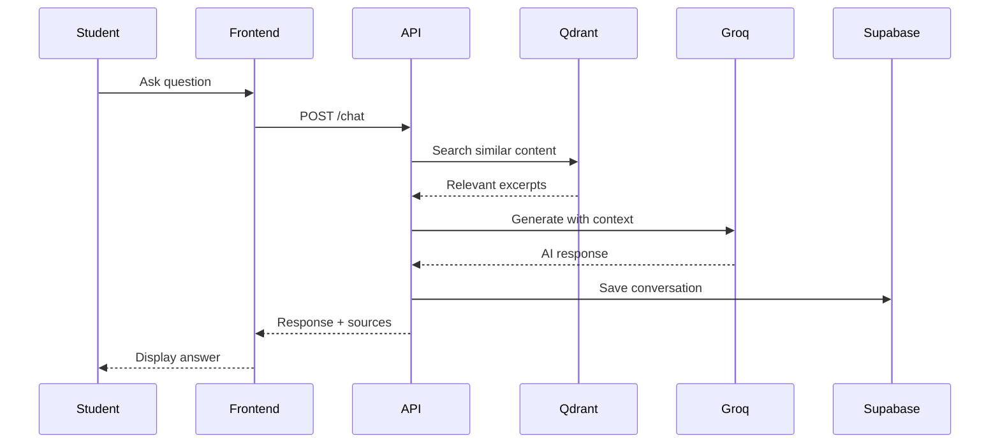
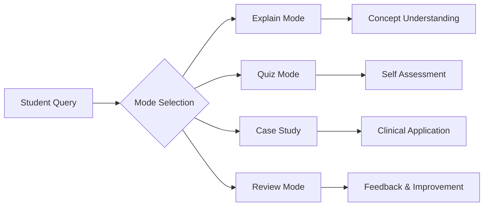

# 🏥 SPLA031 — Physiology Module Tutor
### University of Limpopo · Department of Physiology

[](https://srh-tutor-1.onrender.com)
[](https://python.org)
[](https://fastapi.tiangolo.com)
[](https://console.groq.com)
[](https://ul.ac.za)

---

## 📋 Table of Contents

- [About](#-about)
- [Features](#-features)
- [Tech Stack](#️-tech-stack)
- [Quick Start](#-quick-start)
- [Usage Guide](#-usage-guide)
- [Architecture](#️-architecture)
- [API Reference](#-api-reference)
- [Deployment](#-deployment)
- [Project Structure](#-project-structure)
- [Contributing](#-contributing)

---

## 🏛️ About

An intelligent AI tutoring system built for the **University of Limpopo's Department of Physiology** to support the **SPLA031** module. This system provides students with 24/7 access to course materials through natural language conversations, delivering accurate, source-cited answers from official lecture notes, textbooks, and practical manuals.

> *"Empowering physiology education through intelligent tutoring systems"*

### 🎯 Purpose

- Provide on-demand physiology tutoring aligned to the SPLA 031 curriculum
- Reduce lecturer workload for routine concept queries
- Improve student understanding through RAG-grounded, cited answers
- Enable 24/7 access to course materials from any device
- Surface common learning challenges for faculty review

### 🌍 Live Access

| Platform | URL |
|---|---|
| **Production** | `https://srh-tutor-1.onrender.com` |

---

## ✨ Features

### 📚 Course-Specific Knowledge

| Feature | Description |
|---|---|
| Complete Syllabus Coverage | All SPLA 031 lecture notes ingested and searchable |
| Source Attribution | Every answer cites the specific source and page number |
| Multi-format Support | Textbooks, lecture slides, and practical manuals |

### 🎓 Academic Tools

| Mode | How to Activate | Purpose |
|---|---|---|
| **Quiz Mode** | `"Quiz me on [topic]"` | Practice questions, one at a time |
| **Case Studies** | `"Case study on [condition]"` | Clinical scenario reasoning |
| **Revision** | `"Summarize [topic]"` | Quick exam prep summaries |
| **Practical Prep** | `"What should I know for the [practical]?"` | Lab preparation |
| **Review** | `"Review my answer: [text]"` | Constructive written feedback |

### 📱 Mobile-First Design

- ✅ Responsive across all devices (320px → 4K)
- ✅ Low data usage — under 100 KB per query
- ✅ Touch-optimised interface
- ✅ No app installation required
- ✅ Works on campus WiFi and mobile data

---

## 🧠 Physiology Topics Covered

| System | Key Topics | Practical Applications |
|---|---|---|
| **Cellular Physiology** | Membrane transport, ion channels, signalling | Patch clamp techniques |
| **Neurophysiology** | Action potentials, synapses, CNS organisation | EEG interpretation |
| **Muscle Physiology** | Contraction mechanisms, fibre types | EMG analysis |
| **Cardiovascular** | Cardiac cycle, circulation, regulation | ECG, blood pressure |
| **Respiratory** | Gas exchange, ventilation control | Spirometry |
| **Renal** | Filtration, reabsorption, acid-base | Urinalysis |
| **Endocrine** | Hormones, feedback loops | Hormone assays |
| **Gastrointestinal** | Digestion, absorption, motility | Motility studies |
| **Reproductive** | Gametogenesis, hormonal control | Fertility assessments |

---

## 🛠️ Tech Stack

**Backend**
```yaml
API Framework:   FastAPI
LLM Provider:    Groq (llama-3.3-70b-versatile)
Vector Database: Qdrant Cloud
User Database:   Supabase (PostgreSQL)
Authentication:  Supabase Auth
Embeddings:      ONNX Runtime (all-MiniLM-L6-v2)
PDF Processing:  PyMuPDF
```

**Frontend**
```yaml
Language:   HTML5, CSS3, Vanilla JavaScript
Styling:    CSS Custom Properties (Variables)
Fonts:      Google Fonts (Playfair Display, Outfit)
Responsive: Mobile-first, 6 breakpoints
```

**Infrastructure**
```yaml
Hosting:    Render.com
```

---

## 🚀 Quick Start

### Prerequisites

- Python 3.14+
- [Supabase](https://supabase.com) account
- [Qdrant](https://qdrant.tech) account
- [Groq](https://console.groq.com) API key

### 1. Clone the Repository

```bash
git clone https://github.com/yourusername/spla-031-tutor.git
cd spla-031-tutor
```

### 2. Configure Environment Variables

Create a `.env` file in the project root:

```env
# Supabase
SUPABASE_URL=https://your-project.supabase.co
SUPABASE_ANON_KEY=your-anon-key
SUPABASE_SERVICE_KEY=your-service-role-key

# Qdrant
QDRANT_URL=https://your-cluster.cloud.qdrant.io
QDRANT_API_KEY=your-api-key

# Groq
GROQ_API_KEY=your-groq-api-key

# Optional: Hugging Face (for gated models)
HF_TOKEN=your-hf-token
```

### 3. Set Up Supabase Tables

Run the following SQL in your Supabase SQL editor:

```sql
-- User profiles
CREATE TABLE profiles (
  id UUID REFERENCES auth.users PRIMARY KEY,
  full_name TEXT,
  email TEXT,
  role TEXT DEFAULT 'trainee',
  created_at TIMESTAMPTZ DEFAULT NOW(),
  last_seen TIMESTAMPTZ
);

-- Chat messages
CREATE TABLE chat_messages (
  id UUID PRIMARY KEY,
  user_id UUID REFERENCES auth.users,
  role TEXT,
  content TEXT,
  sources TEXT[],
  created_at TIMESTAMPTZ DEFAULT NOW()
);
```

### 4. Install Dependencies

```bash
pip install -r requirements.txt
```

### 5. Ingest Course Materials

```bash
# Ingest SPLA 031 lecture notes
python ingest_srh.py "SPLA_031_Lecture_Notes_2024.pdf"

# Ingest textbook chapters
python ingest_srh.py "Guyton_Chapter_10_Cardiac.pdf"

# Ingest practical manuals
python ingest_srh.py "Physiology_Practical_Manual.pdf"
```

> The script will prompt you to **ADD** (append to existing collection) or **REPLACE** (start fresh), and ask for a citation label (e.g. `SPLA 031 Lecture 5 – Heart Physiology`).

### 6. Run Locally

```bash
# Development (with hot reload)
uvicorn app:app --host 0.0.0.0 --port 8000 --reload

# Production
uvicorn app:app --host 0.0.0.0 --port $PORT
```

Visit `http://localhost:8000` to access the tutor.

---

## 📖 Usage Guide

### For Students

**Registration**

1. Navigate to `https://srh-tutor-1.onrender.com`
2. Click **Sign Up**
3. Enter your `@ul.ac.za` email and set a password (min. 6 characters)
4. Check your inbox for the confirmation link
5. Sign in and start learning

**Example Queries**

| Category | Example Question |
|---|---|
| Cardiovascular | `"Explain the Frank-Starling mechanism"` |
| Neurophysiology | `"Describe an action potential step by step"` |
| Respiratory | `"How is breathing rate regulated?"` |
| Renal | `"Walk me through the RAAS system"` |
| Acid-Base | `"What is respiratory acidosis?"` |
| Endocrine | `"Compare Type 1 and Type 2 diabetes"` |
| Muscle | `"Explain excitation-contraction coupling"` |

**Recommended Study Workflow**

```
Before Lecture  →  "Summarize next week's topic: renal system"
During Study    →  "Quiz me on action potentials"
Exam Prep       →  "Generate 10 MCQ questions on acid-base"
Practical Prep  →  "Interpret these blood gas values: pH 7.25, pCO2 60"
```

### For Lecturers

**Adding New Content**

```bash
# Append new material (preserves existing data)
python ingest_srh.py "SPLA_031_Week5_Cardiovascular.pdf"
# Select option 1: ADD to existing collection
# Label: "SPLA 031 Lecture 5 - Heart Physiology"

# Full refresh (new semester)
python ingest_srh.py "Updated_Curriculum_2025.pdf"
# Select option 2: REPLACE collection
```

**Monitoring Usage**

```sql
-- Weekly active students
SELECT
  DATE_TRUNC('week', created_at) AS week,
  COUNT(DISTINCT user_id)        AS active_students,
  COUNT(*)                       AS total_queries
FROM chat_messages
GROUP BY week
ORDER BY week DESC;

-- Most frequently asked topics
SELECT
  SUBSTRING(content, 1, 80) AS query_sample,
  COUNT(*)                  AS frequency
FROM chat_messages
WHERE role = 'human'
GROUP BY query_sample
ORDER BY frequency DESC
LIMIT 20;
```

---

## 🏗️ Architecture

```
┌─────────────────────────────────────────────────────────────┐
│                        Client Layer                          │
│     Browser → Static HTML/CSS/JS ← localStorage cache       │
└─────────────────────────────────────────────────────────────┘
                              │
                              ▼
┌─────────────────────────────────────────────────────────────┐
│                         API Layer                            │
│   FastAPI:                                                   │
│   • /auth/*         → Authentication                        │
│   • /chat           → RAG-powered responses                 │
│   • /chat/history   → Conversation storage                  │
│   • /health         → Liveness check                        │
│   • /ready          → Model warm-up status                  │
└─────────────────────────────────────────────────────────────┘
          │                     │                    │
          ▼                     ▼                    ▼
  ┌───────────────┐    ┌────────────────┐   ┌───────────────┐
  │   Qdrant      │    │   Groq LLM     │   │   Supabase    │
  │  Vector DB    │    │  llama-3.3-70b │   │  Auth + DB    │
  ├───────────────┤    ├────────────────┤   ├───────────────┤
  │ Manual chunks │    │ Response gen.  │   │ User profiles │
  │ Chat history  │    │ Context fusion │   │ Chat history  │
  │ Page vectors  │    │                │   │ Session mgmt  │
  └───────────────┘    └────────────────┘   └───────────────┘
```

**Data Flow:** User query → ONNX embed → Qdrant semantic search → Top 3 chunks injected into system prompt → Groq LLM generates cited response → Saved to Supabase + Qdrant

---
## 🏗️ Architecture

### System Design


### Learning Flow


---

## 📊 API Reference

### Authentication

**`POST /auth/signup`**
```json
// Request
{ "email": "student@ul.ac.za", "password": "secure123", "full_name": "Jane Doe" }

// Response
{ "message": "Account created! Please check your email to confirm.", "user_id": "uuid" }
```

**`POST /auth/signin`**
```json
// Request
{ "email": "student@ul.ac.za", "password": "secure123" }

// Response
{ "access_token": "jwt-token", "user": { "id": "uuid", "email": "...", "full_name": "..." } }
```

**`POST /auth/resend-confirmation`** — Resend email confirmation link

**`GET /auth/me`** — Return current user profile *(requires Bearer token)*

### Chat

> All chat endpoints require `Authorization: Bearer <token>`

**`POST /chat`**
```json
// Request body
{ "message": "Explain the cardiac cycle" }

// Response
{
  "response": "The cardiac cycle consists of... [detailed explanation with citations]",
  "sources": ["SPLA 031 Lecture 5, Page 12", "Guyton & Hall Chapter 9, Page 145"]
}
```

**`GET /chat/history`** — Last 30 messages for the current user

**`DELETE /chat/history`** — Clear all history for the current user

**`GET /chat/stats`** — Total question count for the current user

### System

**`GET /health`** — Liveness check

**`GET /ready`** — Returns whether embedder and agent are fully loaded

---

## 🚢 Deployment

### Deploy on Render

1. Create a **New Web Service** and connect your GitHub repository.
2. Configure build settings:

```yaml
Build Command: python build.py && pip install -r requirements.txt
Start Command: uvicorn app:app --host 0.0.0.0 --port $PORT
```

3. Add all variables from your `.env` file to the Render dashboard under **Environment**.
4. Enable **Auto-Deploy** on the `main` branch for zero-downtime deployments.

### Local Production Test

```bash
python build.py
uvicorn app:app --host 0.0.0.0 --port 8000 --workers 4
```

### On-Premises (Future)

Minimum requirements for self-hosted deployment:

```yaml
CPU:     4 cores
RAM:     8 GB
Storage: 50 GB
OS:      Ubuntu 22.04 LTS
Network: University LAN with outbound HTTPS
```

---

## 📁 Project Structure

```
spla-031-tutor/
├── app.py                  # Main FastAPI application — routes, agent, chat logic
├── ingest_srh.py           # PDF ingestion tool — chunks and uploads to Qdrant
├── srh_embedder.py         # ONNX embedding wrapper (embed / embed_one)
├── build.py                # Build-time model download for Render
├── requirements.txt        # Python dependencies
├── .env.example            # Environment variables template
├── README.md               # This file
├── LICENSE                 # Academic licence
│
├── static/
   └── index.html          # Single-page frontend application

```

---

## 🤝 Contributing

### For Students

- Report bugs via [GitHub Issues](../../issues)
- Suggest features using issue templates
- Share feedback with your lecturers

### For Developers

```bash
# 1. Fork and clone
git clone https://github.com/your-username/spla-031-tutor.git
cd spla-031-tutor

# 2. Create a feature branch
git checkout -b feature/your-feature-name

# 3. Make changes, then commit
git commit -m "feat: add your feature description"

# 4. Push and open a Pull Request
git push origin feature/your-feature-name
```

**Guidelines:** Follow PEP 8, add tests for new features, update documentation, and maintain backward compatibility.

---

## 🙏 Acknowledgements

| Contributor | Contribution |
|---|---|
| Department of Physiology | Content expertise |
| SPLA 031 Students | Beta testing and feedback |
| Groq | Free academic LLM access |
| Qdrant | Vector database sponsorship |
| Supabase | Open source credits |

---


---

<div align="center">

⭐ **Star this repo if you find it useful!**

[Live Demo](https://srh-tutor-1.onrender.com) · [Report a Bug](../../issues/new?template=bug_report.md) · [Request a Feature](../../issues/new?template=feature_request.md)

*Made with ❤️ for SPLA 031 students at the University of Limpopo*

</div>
